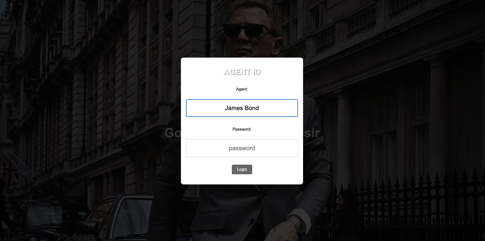

# Welcome to the James Bond Office Project

## Description
This project is an interactive web application where users step into the world of James Bond. The application features a login system for Agent 007 and allows navigation to different mission pages, each themed around famous Bond-style adventures.

## Features
- Interactive login system for Agent 007.
- Dynamic mission pages with unique tasks and themes.
- Stunning background images for an immersive experience.
- Responsive design for all devices.

## Technologies Used
- **HTML5**: Structuring the web pages.
- **CSS3**: Styling the pages and adding animations.
- **JavaScript**: Implementing functionality like the login system and page navigation.
- **SweetAlert2**: For stylish notifications and alerts.

## How to Use
1. Open the application in a browser.
2. Log in with the credentials:
   - **Username**: James Bond
   - **Password**: 007
3. Navigate to mission pages and enjoy the interactive content.

## Preview

## Demo Video
Watch a demo of the project on YouTube: [James Bond Office Demo](https://www.youtube.com/watch?v=NSP1qDXiFZg)

## Description
This project is an interactive web application where users step into the world of James Bond. The application features a login system for Agent 007 and allows navigation to different mission pages, each themed around famous Bond-style adventures.

## Features
- Interactive login system for Agent 007.
- Dynamic mission pages with unique tasks and themes.
- Stunning background images for an immersive experience.
- Responsive design for all devices.

## Technologies Used
- **HTML5**: Structuring the web pages.
- **CSS3**: Styling the pages and adding animations.
- **JavaScript**: Implementing functionality like the login system and page navigation.
- **SweetAlert2**: For stylish notifications and alerts.

## How to Use
1. Open the application in a browser.
2. Log in with the credentials:
   - **Username**: 
   - **Password**: 
3. Navigate to mission pages and enjoy the interactive content.

